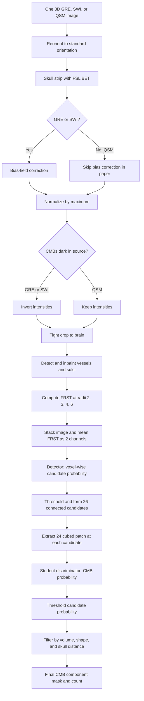
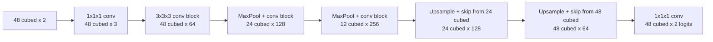
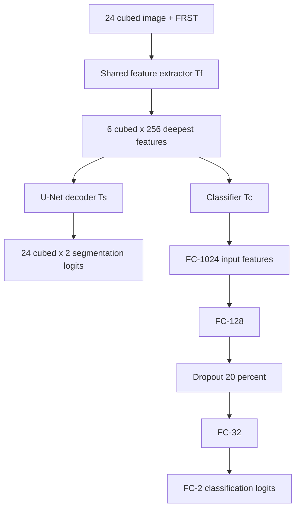
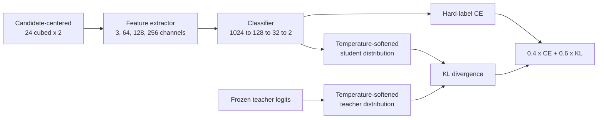
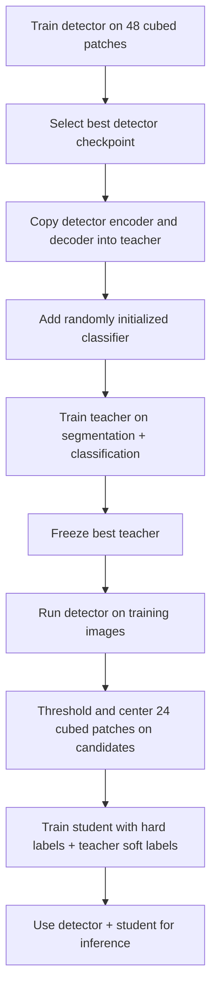
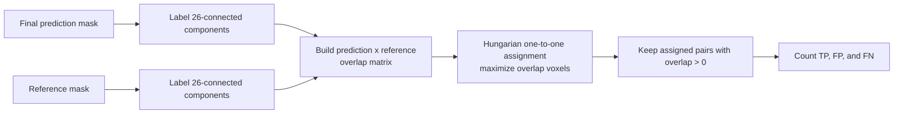

## Scope and source conventions

The paper is Sundaresan et al. (2023), *Automated detection of cerebral
microbleeds on MR images using knowledge distillation framework*, Frontiers in
Neuroinformatics 17:1204186, DOI
[10.3389/fninf.2023.1204186](https://doi.org/10.3389/fninf.2023.1204186).

The method finds cerebral microbleeds (CMBs) in one 3D MR image. It first finds
many possible lesions, then rejects likely mimics, and finally removes objects
whose size, shape, or location is implausible.

This guide uses the following labels because the article and this repository
are not identical in every detail:

* **Paper** means the value or operation is stated in the article
* **Repository** means the detail is explicit in this implementation
* **Derived** means the detail follows from the published layer diagram or code
* **Not specified** means the article does not provide enough information to
  reproduce the choice exactly

> [!IMPORTANT]
> The article describes the scientific method. This repository is a modern
> reimplementation, not a byte-for-byte copy of the 2023 Python 3.6 and
> PyTorch 1.2.0 code. The most important known difference is bias correction:
> the paper uses FSL FAST, while this repository uses SimpleITK N4.

## End-to-end method

The teacher is used only while training the student. Production inference loads
the detector and student, not the teacher.

## Data preprocessing

### Modality-specific sequence reported in the paper

The operations must occur in this order because later operations assume that
the image has already been skull stripped and that CMBs are bright.

| Order | T2*-GRE and SWI | QSM | Purpose |
|---:|---|---|---|
| 1 | Reorient to MNI template orientation | Same | Put axes in a consistent orientation |
| 2 | Skull strip with FSL BET | Same | Remove non-brain anatomy |
| 3 | Correct bias field with FSL FAST | Not applied | Reduce smooth intensity nonuniformity |
| 4 | Divide every intensity by the image maximum | Same | Normalize the intensity scale |
| 5 | Replace normalized intensity $x$ with $1-x$ | Do not invert | Make CMBs bright for every modality |
| 6 | Crop close to nonzero brain edges | Same | Reduce the field of view |
| 7 | Detect vessels, sulci, and elongated structures, then inpaint them | Same | Suppress common CMB mimics |

The paper does not report BET options, FAST options, interpolation settings for
reorientation, crop margins, or how negative QSM values are handled during
normalization. These choices cannot be reconstructed exactly from the article.

### Repository preprocessing sequence

The executable order is defined in
[processor.py](../src/microbleednet/core/engines/processor.py):

1. Record the source shape, affine, and orientation for later restoration.
2. Reorient to the closest canonical nibabel orientation.
3. Apply the same orientation transform to the reference mask, when supplied.
4. Run FSL BET with no additional command-line options.
5. For T2*-GRE and SWI, run SimpleITK N4 bias-field correction inside the
  nonzero brain mask. Skip bias correction for QSM.
6. Convert to `float32` and divide by the positive finite maximum.
7. Invert using `max(volume) - volume` for T2*-GRE and SWI, then zero voxels outside the
   pre-inversion nonzero mask.
8. Find the first and last nonzero plane on each axis and crop to that bounding
   box. There is no extra margin.
9. Apply the same crop to the reference mask.
10. Detect and inpaint vessel-like structures.
11. Store voxel spacing, the cropped affine, and the reversible orientation and
    crop transform.

The repository uses SimpleITK N4 wherever the paper uses FSL FAST. The only
preprocessing difference in this step is the correction implementation itself:
QSM also skips bias correction in the repository, matching the paper.

The corresponding fixed preprocessing contract is:

| Parameter | Paper preset | Meaning |
|---|---:|---|
| `modality` | `T2*-GRE`, `SWI`, or `QSM` | Select the input modality and inversion behavior |
| Fixed orientation | Always enabled | Reorient before other processing |
| Fixed brain extraction | Always enabled | Run FSL BET |
| Fixed bias correction | GRE/SWI only | Run SimpleITK N4; skip for QSM |
| Fixed vessel inpainting | Always enabled | Remove elongated mimics |

### Vessel and sulcus removal

The paper summarizes the method from Sundaresan et al. (2022). Its cited
building blocks are Frangi et al. (1998) for multiscale vesselness and Förstner
(1994) for structure-tensor features.

The paper specifies the following sequence:

1. Extract edge and orientation features with Frangi filtering and structure
   tensor eigenvalues.
2. Cluster the features with K-means to produce a vessel mask.
3. For every masked voxel, use the mean intensity of immediately adjacent,
   non-masked voxels in its 26-connected 3D neighborhood.

The repository makes additional choices in
[inpaint_vessels.py](../src/microbleednet/core/transforms/inpaint_vessels.py):

| Repository-only setting | Value |
|---|---:|
| Processing geometry | 2D, one slice at a time |
| Frangi `sigmas` | `(0.5, 1.2, 0.2)` |
| Frangi `alpha` | `0.9` |
| Frangi `beta` | `20` |
| Frangi `black_ridges` | `false` |
| Linearity measure | $|\lambda_1-\lambda_2|/2$ |
| K-means clusters | `2` |
| K-means seed | `42` |
| Vessel cluster | The cluster with fewer pixels |
| Region eccentricity boundary | `0.9` |
| Region solidity boundary | `0.5` |
| Mask expansion | One binary-dilation iteration |
| Inpainting neighborhood | $3\times3\times3$ minus the center, at most 26 voxels |

The implementation retains a clustered region unless it is both less
eccentric than `0.9` and more solid than `0.5`. This is repository behavior,
not a threshold reported in the 2023 paper. Inpainting proceeds from valid
boundary neighbors toward the center of a masked region. It fails rather than
silently leaving unresolved voxels.

### Fast radial symmetry transform

FRST highlights locally circular bright objects. This gives the detector a
shape cue in addition to image intensity.

The paper computes 2D FRST responses at radii 2, 3, 4, and 6 voxels and averages
the four maps. The repository additionally sets the symmetry exponent to 2,
Gaussian scale factor to 0.1, bright features on, and dark features off in
[frst.py](../src/microbleednet/core/transforms/frst.py).

For a radius $r$, the implementation performs these steps on each slice:

1. Compute the image gradient and its magnitude.
2. Move $r$ voxels along the normalized gradient from every nonzero-gradient
   pixel.
3. Accumulate orientation votes and gradient magnitudes at those destinations.
4. Normalize orientation and magnitude maps independently to $[0,1]$.
5. Form a response $S_r=|O_r|^\alpha|M_r|$, where $\alpha=2$.
6. Smooth with a Gaussian whose $\sigma=0.1r$.
7. Average $S_r$ over $r\in\{2,3,4,6\}$.

Every model receives a tensor with shape `(batch, 2, H, W, D)`: channel 0 is
the preprocessed image and channel 1 is its FRST response.

## Model architecture

### Shared layer definitions

All convolutions are 3D. Unless stated otherwise, a convolution is followed by
batch normalization and ReLU.

| Name | Exact operation |
|---|---|
| `SingleConv` | `Conv3d -> BatchNorm3d -> ReLU` |
| `DoubleConv` | Two `SingleConv` operations |
| `DownConv` | `MaxPool3d(2) -> DoubleConv` |
| `UpConv` | Stride-2 transposed convolution, concatenate encoder skip, then `DoubleConv` |
| Output projection | $1\times1\times1$ `Conv3d`, no softmax inside the model |

The detector and teacher use a shallow U-Net with only two pooling operations.
The feature extractor is shared between the teacher's segmentation and
classification heads. The student keeps the feature extractor and classifier
but removes the segmentation decoder.

### Candidate detector

The detector's job is high sensitivity. False positives are acceptable here
because later stages can reject them; a missed lesion cannot be recovered.

**Training input:** non-overlapping $48\times48\times48$ patches with two
channels, image and FRST.

**Inference input:** the complete preprocessed 3D image with its FRST channel.
The paper explicitly uses patches only for training at this stage.

**Output:** two voxel-wise logits at the original spatial size. Softmax class 1
is the CMB candidate probability map $P_{Cdet}$.

The first projection from 2 to 3 channels and the initial width of 64 are
unusual but intentional. With the repository layer definitions, the full path
is `2 -> 3 -> 64 -> 128 -> 256 -> 128 -> 64 -> 2`.

### Multi-task teacher discriminator

The teacher learns two tasks at the same time:

* Mark CMB voxels with a U-Net segmentation head $T_s$
* Classify the entire patch as CMB or non-CMB with head $T_c$

The shared feature extractor $T_f$ must therefore learn features useful for
both precise localization and mimic rejection.

**Training input:** adjacent, non-overlapping $24^3$ two-channel patches. The
paper contrasts these broadly sampled patches with the student's
candidate-centered patches.

**Initialization:** copy the trained detector's feature extractor and segmentor
weights. Initialize the new classifier from a truncated normal distribution.
The paper allows fully random initialization as an alternative but uses the
pretrained path for the described method.

**Outputs:** a $24^3\times2$ voxel-logit volume and one 2-class patch-logit
vector.

The paper's diagram shows the classifier reducing its feature map to
$2^3\times128=1024$ values before the dense layers. The repository enforces the
$24^3$ input size and implements the classifier as follows:

| Classifier stage | Repository output |
|---|---|
| Shared encoder output | $6^3\times256$ |
| Padded $1^3$ projection, 256 to 128 channels | $8^3\times128$ |
| Max-pool plus two $3^3$ convolutions | $4^3\times128$ |
| Max-pool plus two $3^3$ convolutions | $2^3\times128$ |
| Flatten | 1024 values |
| Dense layers | `1024 -> 128 -> 32 -> 2` |

> [!NOTE]
> Padding a $1\times1\times1$ convolution by one voxel is an implementation
> detail that expands $6^3$ to $8^3$. It is not stated in the paper. The paper's
> conceptual architecture and its final 1024-feature size are preserved.

### Student discriminator

The student has the same feature extractor and classifier shape as the teacher,
but no segmentation decoder. It is the lightweight model used during inference.

**Training input:** $24^3$ two-channel patches centered on connected-component
centroids from the thresholded detector output.

**Teacher input during distillation:** the exact same student patches. The
teacher is frozen, put in inference mode, and supplies soft target logits.

**Inference input:** one $24^3$ image patch centered on each detector candidate,
with FRST computed from that patch.

**Output:** two patch-level logits. Softmax class 1 is the probability that the
candidate is a true CMB.

### Weight initialization

The paper initializes convolutional and dense weights from a truncated normal
distribution with standard deviation `0.05`; biases are constant `0.1`. The
repository applies this to `Conv3d` and `Linear` modules. Batch-normalization
parameters and transposed convolutions retain PyTorch defaults in the current
implementation.

## Patch construction and augmentation

### Patch roles

| Stage | Patch size | Sampling described in paper | Dataset expansion |
|---|---:|---|---:|
| Detector | $48^3$ | Non-overlapping training patches | $10\times$ |
| Teacher | $24^3$ | Adjacent, non-overlapping patches across the image | $5\times$ |
| Student | $24^3$ | Centered on thresholded detector candidates | $5\times$ |
| Validation and inference | Stage-specific | No augmentation | $1\times$ |

The paper avoids rotations and down-scaling because interpolation can erase a
2-to-10 mm lesion. It uses random combinations of translation, Gaussian noise,
and mild Gaussian smoothing.

| Transformation | Exact paper range | Scope |
|---|---|---|
| Translation | x and y offsets sampled from `[-15, 15]` voxels | Image and mask move together; no z translation |
| Gaussian noise | Mean $\mu=0$, variance $\sigma^2\in[0.01,0.04]$ | Intensity image only |
| Gaussian blur | $\sigma\in[0.1,0.2]$ voxels | Intensity image only |

The repository chooses one, two, or all three transformations without
replacement, then applies the chosen operations in random order. Translation
uses zero fill and never wraps values across an edge. The article says “random
combinations” but does not state this selection distribution or ordering.

The repository also uses balanced training batches: half of every batch has a
CMB and half does not. The batch size must therefore be even. This realizes the
paper's strategy for reducing foreground/background imbalance, but the exact
sampler rule is repository-specific.

## Loss functions

### Detector loss

The detector adds a foreground Dice loss and weighted voxel-wise cross entropy:

$$
L_{det}=L_{Dice}+L_{CE,voxel}.
$$

The CMB class receives 10 times the weight of background in cross entropy. The
repository uses weights `[1, 10]` and Dice smoothing `1.0`:

$$
L_{Dice}=1-\frac{2\sum_i p_i y_i+1}{\sum_i p_i+\sum_i y_i+1}.
$$

### Teacher loss

The teacher adds its two task losses with equal, unreported scaling:

$$
L_T=L_{det}(T_s)+CE(y,T_c).
$$

The segmentation term teaches voxel localization. The patch classification term
penalizes CMB-like false positives.

### Student knowledge-distillation loss

For logits $z_i$ and temperature $\tau$, softened class probabilities are:

$$
\sigma(z_i,\tau)=\frac{\exp(z_i/\tau)}
{\sum_{j=1}^{N}\exp(z_j/\tau)}.
$$

The student objective is:

$$
L_S=\alpha\,CE(y,\sigma(z_S,1))+
\beta\,KL(\sigma(z_S,\tau),\sigma(z_T,\tau)),
$$

with $\tau=4$, $\alpha=0.4$, and $\beta=0.6$. These values were selected by
trial and error on the independent 20-subject VALDO tuning subset. The
repository requires $\alpha+\beta=1$.

The repository implements unscaled batch-mean KL divergence. It does not
multiply the KL term by $\tau^2$, a convention used in some other distillation
implementations but not specified by this paper.

## Training procedure and settings

### Shared paper settings

| Setting | Value |
|---|---:|
| Framework in original experiments | Python 3.6, PyTorch 1.2.0 |
| Original hardware | NVIDIA Tesla V100 |
| Optimizer | Adam |
| Initial learning rate | $10^{-3}$ |
| Adam epsilon | $10^{-4}$ |
| Batch size | 8 |
| Maximum epochs | 100 |
| Learning-rate reduction | Multiply by $10^{-1}$ every 2 epochs |
| Learning-rate floor | $10^{-6}$ |
| Early-stopping patience | 20 validation epochs without progress |
| Detector convergence reported | About 80 epochs, about 15 minutes per epoch |
| Teacher convergence reported | About 80 epochs, about 20 minutes per epoch |
| Student convergence reported | About 50 epochs, less than 5 minutes per epoch |

The resulting paper schedule starts at $10^{-3}$, reaches $10^{-4}$ after the
first two-epoch period, then $10^{-5}$, then the $10^{-6}$ floor, where it
remains.

### Repository training additions

These settings are explicit in the current trainer but are not reported in the
article:

| Setting | Repository default |
|---|---:|
| Weight decay | `0.0` |
| Gradient norm clipping | `1.0` |
| Minimum validation improvement | `0.0` |
| Automatic mixed precision | Off by default; available on CUDA |
| `torch.compile` | On when available |
| Checkpoints | Latest and best validation-loss states |
| Resume state | Model, optimizer, scheduler, scaler, epoch, and early stopping |

## Inference and output postprocessing

### Candidate detection and discrimination

1. Preprocess one complete image and generate its FRST channel.
2. Run the detector on the complete volume.
3. Apply softmax and select the CMB probability $P_{Cdet}$.
4. Threshold $P_{Cdet}$ at $Th_{Cdet}$.
5. Group foreground voxels with 26-connectivity.
6. Compute each component's centroid and round it to a voxel center.
7. Extract a $24^3$ image patch around every center.
8. Compute FRST for each patch and run the student.
9. Apply softmax and keep candidates whose CMB probability is at least
   $Th_{Cdisc}$.
10. Reconstruct a mask from the original detector components that passed the
    student threshold.

The article reports several operating thresholds because they were selected at
FROC knee points for different experiments:

| Experiment | $Th_{Cdet}$ | $Th_{Cdisc}$ |
|---|---:|---:|
| UKBB ablation, detector with FRST | `0.5` | Not applicable |
| UKBB ablation, teacher alone | `0.5` upstream | `0.29` |
| UKBB ablation, student with KD | `0.5` upstream | `0.30` |
| UKBB ablation, student without KD | `0.5` upstream | `0.35` |
| UKBB 5-fold cross-validation | `0.30` | `0.30` |
| OXVASC 5-fold cross-validation | `0.20` | `0.20` |
| Cross-dataset tests trained on UKBB | `0.30` | `0.30` |
| Repository T2*-GRE paper presets | `0.20` | `0.20` |

There is no single universal “paper threshold.” It is a tunable operating point
that trades sensitivity against false positives.

### Morphological cleanup

Cleanup is applied after student discrimination. Components are formed with
26-connectivity and rejected when any condition below is true.

| Attribute | Rejection rule | Intended target |
|---|---|---|
| Physical volume | Volume $<2.5\text{ mm}^3$ | Stray noise and tiny specks |
| Ellipticity or eccentricity | Value $>0.2$ | Tubular vessel and sulcus fragments |
| Distance from skull or brain boundary | Distance $<5$ mm | Sulci and susceptibility artifacts near the skull |

The paper selected these thresholds empirically from density plots on the
independent 20-subject VALDO subset, which was not used for later training or
testing.

The repository computes the quantities as follows in
[filters.py](../src/microbleednet/core/postprocessing/filters.py):

* Physical volume is voxel count times $s_xs_ys_z$, using NIfTI spacing
* Shape is the 2D eccentricity of the largest-area orthogonal projection
* Boundary distance is the minimum, over component voxels, of a spacing-aware
  Euclidean distance transform inside the extracted brain mask
* A rejected component is removed from both the binary mask and probability map

The paper calls the shape measure “ellipticity,” while the repository uses
`skimage`'s projection eccentricity. These terms are not mathematically
interchangeable, so reproducing the original result requires confirming the
original source implementation.

The paper observed approximate false-positive reductions of 65% from the skull
distance rule, 25% from area or volume, and 15% from shape when applied
successively. These percentages overlap in effect and do not sum to a causal
decomposition. Cleanup also removes some true CMBs near the skull, which
slightly lowers sensitivity.

### Restoring and writing outputs

The repository places the cropped prediction back into the canonical image,
applies the inverse orientation transform, and writes it with the source affine.
It produces:

* A source-space binary NIfTI prediction mask
* A source-space NIfTI probability map
* JSON and CSV candidate records containing detector probability, student
  probability, and acceptance decisions

## Evaluation protocol

### Ground-truth preparation

| Dataset | Images and subjects | Ground truth used by the paper |
|---|---|---|
| UK Biobank | 78 SWI subjects; QSM also available; 186 CMBs | Radiologist-provided CMB coordinates on SWI, expanded by region growing with maximum radius 5 voxels in-plane and 3 through-plane |
| OXVASC | 74 T2*-GRE subjects; 36 CMB-positive; 366 CMBs | Manual segmentations available for all 36 CMB-positive subjects |
| TICH2 | 115 SWI subjects with ICH; 71 CMB-positive; 849 CMBs | Manual masks include both MARS “definite” and “possible” CMBs |
| SHK | 20 public SWI subjects; 126 CMBs | Coordinate-derived masks built like UKBB, unioned with an independent second rater's masks |

For UKBB and SHK, the region-growing intensity and distance formula is not
specified in this article. Only the maximum radii are given.

### Lesion-level matching

The paper labels clusters with 26-connectivity. A predicted cluster is a true
positive when it overlaps a ground-truth cluster by at least one voxel. A
predicted cluster with no reference overlap is a false positive. A reference
cluster with no prediction overlap is a false negative.

The current repository adds one-to-one Hungarian assignment that maximizes
total overlap. This prevents one large prediction touching several reference
lesions from receiving several true positives, and prevents several predictions
touching one reference lesion from all receiving credit.

### Metrics

Counts are summed across subjects before ratios are calculated.

Cluster sensitivity, called cluster-wise true positive rate (TPR), is:

$$
TPR_{cluster}=\frac{TP_{cluster}}{TP_{cluster}+FN_{cluster}}.
$$

Cluster precision is:

$$
Precision_{cluster}=\frac{TP_{cluster}}
{TP_{cluster}+FP_{cluster}}.
$$

Average false positives per subject is:

$$
FP_{avg}=\frac{\sum FP_{cluster}}{\text{number of subjects}}.
$$

High TPR and precision are better. Low $FP_{avg}$ is better. These are
lesion-level metrics, not voxel Dice scores.

### FROC construction and threshold choice

A free-response receiver operating characteristic (FROC) curve plots cluster
TPR on the vertical axis against average false positives per subject on the
horizontal axis.

1. Choose a series of probability thresholds.
2. Binarize every subject's probability map at one threshold.
3. Relabel 26-connected components.
4. Match prediction and reference components.
5. Aggregate TP, FP, and FN over the dataset.
6. Plot cluster TPR against $FP_{avg}$.
7. Repeat for every threshold.
8. In the paper, select a higher-TPR knee point as the reported operating point.

The repository can sweep the final written candidate probability maps. The
paper separately plots detector-stage and discriminator-stage FROCs, so a full
paper reproduction must retain probability outputs at both stages.

### Experiments

#### UKBB ablation

The ablation uses 44 training, 10 validation, and 24 test subjects. The test set
contains 40 CMBs. It compares:

1. Detector without FRST
2. Detector with FRST
3. Teacher classifier alone
4. Student-shaped classifier trained only with hard-label cross entropy
5. Student trained with knowledge distillation
6. Final result after morphology-based cleanup

The principal result is that KD increases discrimination-stage cluster TPR from
0.75 to 0.90 in this split, a 15 percentage-point improvement. Postprocessing
then changes the KD result from TPR `0.90`, $FP_{avg}$ `14.7`, precision `0.11`
to TPR `0.83`, $FP_{avg}$ `0.5`, precision `0.74`.

#### Within-dataset cross-validation

The paper runs separate 5-fold cross-validation on UKBB SWI and OXVASC
T2*-GRE. The teacher is pretrained on UKBB and reused in inference mode for
distillation; only each fold's student is trained on the target dataset.

| Dataset | Final cluster TPR | Final $FP_{avg}$ | Final precision |
|---|---:|---:|---:|
| UKBB SWI | `0.93` | `1.5` | `0.59` |
| OXVASC T2*-GRE | `0.90` | `0.9` | `0.84` |

The article does not describe fold construction, stratification, random seed,
or whether all images from one participant are grouped because there is one
image per listed subject. Those details remain non-reproducible from the paper.

#### Cross-domain generalization

Train the method on all 78 UKBB SWI subjects, fix both thresholds at `0.30`, and
test without target-domain retraining:

| Test data | Domain change | Final TPR | Final $FP_{avg}$ | Final precision |
|---|---|---:|---:|---:|
| UKBB QSM | Same subjects, different modality | `0.90` | `1.8` | `0.44` |
| TICH2 SWI | Different population and scanners, same modality | `0.82` | `3.1` | `0.62` |
| SHK SWI | Different population and scanner, same modality | `0.87` | `0.5` | `0.89` |
| OXVASC T2*-GRE | Different population, scanner, and modality | `0.81` | `2.0` | `0.71` |

The UKBB SWI-to-QSM test is not subject-independent because the same people
appear in training and testing. The paper explicitly warns that the model may
partly learn lesion locations, although patch training may reduce this bias.

#### Indirect literature comparison

The paper compares reported cluster TPR, $FP_{avg}$, and precision against prior
methods. This is not a controlled benchmark because datasets, modalities,
annotation rules, and train/test splits differ. Patch-classification studies are
excluded from direct lesion-level comparison when they begin with manually
preselected CMB patches or allow several CMBs in one patch.

## Complete parameter checklist

| Area | Parameter | Paper value | Repository behavior |
|---|---|---:|---|
| CMB appearance | Expected diameter | 2 to 10 mm | No direct diameter filter |
| FRST | Radii | 2, 3, 4, 6 voxels | Same |
| FRST | Radius aggregation | Mean | Same |
| FRST | Symmetry exponent | Not specified | 2 |
| FRST | Gaussian factor | Not specified | 0.1 times radius |
| Detector | Patch size | $48^3$ | Same |
| Detector | Input channels | Image and FRST | Same |
| Detector | Initial channels | 64 after 2-to-3 projection | Same |
| Detector | Output classes | 2 | Same |
| Teacher | Patch size | $24^3$ | Same, enforced by classifier |
| Teacher | Heads | Segmentation and classification | Same |
| Student | Patch size | $24^3$ | Same, enforced by classifier |
| Classifier | Dense widths | 1024, 128, 32, 2 | Same |
| Classifier | Dropout | 20% before FC-128 in paper wording | After FC-128 in repository and figure |
| Initialization | Weight distribution | Truncated normal, std 0.05 | `Conv3d` and `Linear` only |
| Initialization | Bias | 0.1 | Same for initialized modules |
| Augmentation | Detector factor | 10 | Same |
| Augmentation | Discriminator factor | 5 | Same |
| Augmentation | Translation | x/y `[-15,15]` voxels | Same |
| Augmentation | Noise | Gaussian, mean 0, variance `[0.01,0.04]` | Same |
| Augmentation | Blur | Gaussian sigma `[0.1,0.2]` voxels | Same |
| Optimization | Adam learning rate | $10^{-3}$ | Same |
| Optimization | Adam epsilon | $10^{-4}$ | Same |
| Optimization | Batch size | 8 | Same, balanced 4/4 batches |
| Optimization | Epoch limit | 100 | Same |
| Optimization | Early-stop patience | 20 | Same |
| Optimization | LR factor and period | 0.1 every 2 epochs | Same |
| Optimization | LR floor | $10^{-6}$ | Same |
| Detector loss | Positive CE weight | 10 times background | `[1,10]` |
| Student loss | Temperature | 4 | Same |
| Student loss | CE weight $\alpha$ | 0.4 | Same |
| Student loss | KD weight $\beta$ | 0.6 | Same |
| Postprocessing | Minimum volume | 2.5 mm³ | Same |
| Postprocessing | Maximum shape value | 0.2 ellipticity | 0.2 projection eccentricity |
| Postprocessing | Minimum boundary distance | 5 mm | Same |
| Components | Connectivity | 26 | Same |

## Reproduction cautions

* The paper does not publish every FSL, reorientation, region-growing, K-means,
  or random-split option.
* The current repository's N4 correction differs from the paper's FSL FAST.
* The paper calls the final shape feature ellipticity; the repository computes
  projection eccentricity.
* Paper thresholds vary by dataset and experiment. The T2*-GRE presets use
  `0.20`, while UKBB and cross-domain tables often use `0.30`.
* The paper says trained models are applied to whole 3D images, but its detailed
  discrimination procedure classifies candidate-centered patches. The coherent
  interpretation, also used here, is whole-volume detector inference followed
  by patch-wise student inference.
* The paper reports the teacher dropout as occurring “before FC-128,” while its
  figure and this repository place it after the 1024-to-128 layer. The latter is
  the executable interpretation.
* The paper's comparison with prior work is indirect and should not be treated
  as a single shared leaderboard.

## Key references used by the method

* Sundaresan, V. et al. (2023). Automated detection of cerebral microbleeds on
  MR images using knowledge distillation framework.
  <https://doi.org/10.3389/fninf.2023.1204186>
* Sundaresan, V. et al. (2022). Automated detection of candidate subjects with
  cerebral microbleeds using machine learning.
  <https://doi.org/10.3389/fninf.2021.777828>
* Frangi, A. F. et al. (1998). Multiscale vessel enhancement filtering.
* Förstner, W. (1994). A framework for low level feature extraction.
* Loy, G. and Zelinsky, A. (2002). A fast radial symmetry transform for
  detecting points of interest.
* Hinton, G., Vinyals, O., and Dean, J. (2015). Distilling the knowledge in a
  neural network.
* Smith, S. M. (2002). Fast robust automated brain extraction.
  <https://doi.org/10.1002/hbm.10062>
* Zhang, Y., Brady, M., and Smith, S. (2001). Segmentation of brain MR images
  through a hidden Markov random field model and the expectation-maximization
  algorithm. <https://doi.org/10.1109/42.906424>